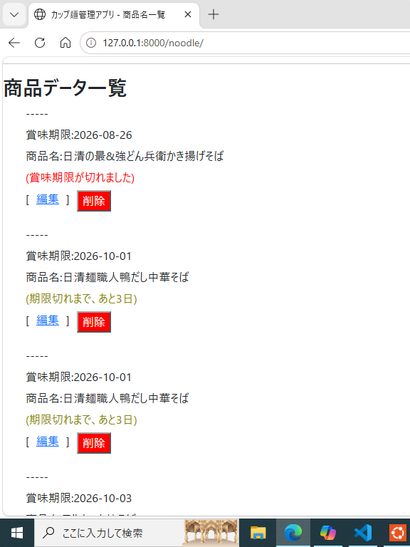
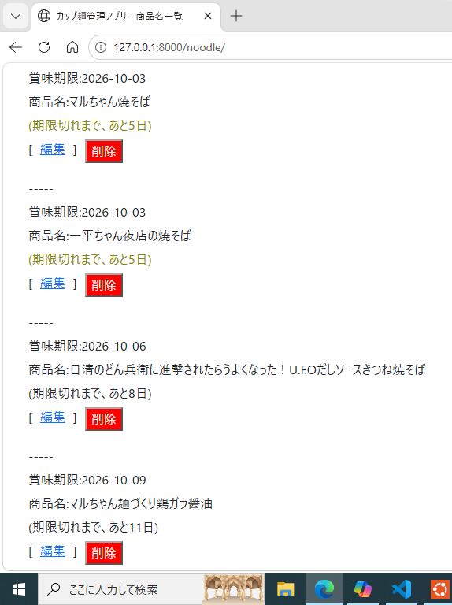
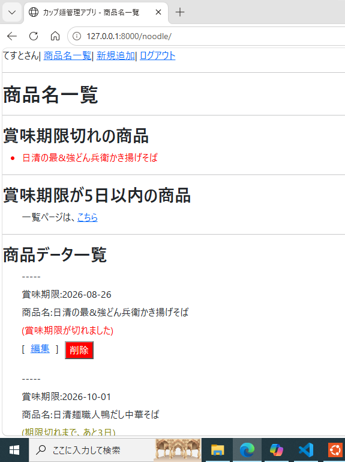
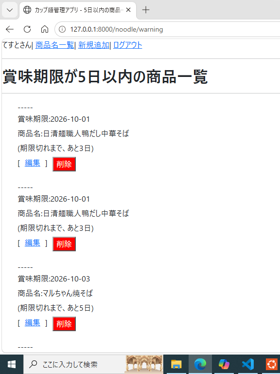

# noodle_management_system

## 1. Overview
&nbsp; This application allows users to manage and check the expiration dates of registered cup noodles.<br>
&nbsp; The remaining days until expiration are automatically calculated, and items are color‑coded to improve visibility.<br>
<br>

## 2. Usage Examples
<br>

<table>
    <tr>
        <td>
             
        </td>
        <td>
            
        </td>
    </tr>
</table>

<br>

#### Color Coding Rules<br>
・6 days or more remaining …… Black<br>
・5 days or less remaining …… Yellow<br>
・Expired …… Red<br>
<br>
&nbsp; On the product list page, items are sorted in ascending order based on how soon their expiration date is approaching.<br>
<br>

<table>
    <tr>
        <td>
            |
        </td>
    </tr>
</table>

<br>

&nbsp; Expired items are grouped and displayed at the top of the page.<br>
<br>

<table>
    <tr>
        <td>
            |
        </td>
    </tr>
</table>

<br>

&nbsp; Items with 5 days or less remaining are displayed on a dedicated warning page.<br>
<br>
<br>

Note: All images are for demonstration purposes only and may differ from the actual application.<br>
<br>

## 3. Features<br>
・User registration and login<br>
・Session management to maintain login state<br>
・Password reset via token-based authentication<br>
・Add, edit, and delete product information (name+expiration date)<br>
・Automatic calculation of remaining days + color-coded display<br>
・Dedicated page for items nearing expiration<br>
<br>

### Security Features<br>
・CSRF protection using SECRET_KEY<br>
・Separation of sensitive information using environment variables(.env)<br>
・Secure password storage using hashing + salt<br>
・Automatic deletion of expired or used tokens via APScheduler<br>
・Encrypted communication using HTTPS<br>
<br>

## 4. Technologies Used<br>
### Language & Framework<br>
・Python 3.x<br>
・Flask<br>

### Libraries & Extensions<br>
・Flask-Login<br>
・Flask-WTF<br>
・Jinja2<br>
・Werkzeug<br>

### Database & ORM<br>
・SQLite<br>
・SQLAlchemy ORM<br>

### Background Processing<br>
・APScheduler<br>

### Environment & Configuration<br>
・Python-dotenv<br>
・config.py<br>

### Architecture & Design<br>
・Blueprint structure<br>
・Application initialization using create_app()<br>
・Application context management<br>
<br>

## 5. Project Structure
```
noodle_management_system
│
├── images                                   # Application demo images
├── README.md                                # Application overview (this file)
├── README_日本語版.md 
├── docs
│    ├─── architecture.md                    # Internal architecture documentation
│    └─── architecture_日本語版.md
│
├── app                                      # Application modules
│    ├── forms.py
│    ├── models.py
│    ├── scheduler.py                        # APScheduler jobs
│    ├── utils.py                            # Password reset email utilities
│    ├── __init__.py                         # create_app() initialization
│    │
│    ├── auth                                # User authentication module
│    │    ├── routes.py
│    │    ├── __init__.py
│    │    │
│    │    └─ templates
│    │  　     └─ auth
│    │  　         ├── forgot_password.html
│    │  　         ├── login.html
│    │  　         ├── register.html
│    │  　         └── reset_password.html
│    │
│    └─── noodle                             # Product management module
│         ├── routes.py
│         ├── __init__.py
│         │
│         └─ templates
│       　     └─ noodle
│       　         ├── base.html
│       　         ├── form.html
│       　         ├── list.html
│       　         └── warning.html          # Items nearing expiration
│
├── Procfile
├── requirements.txt
├── config.py                                # Configuration file
├── run.py
├── .env
└── .gitignore
```
<br>

## 6. Design Highlights<br>
・Color-coded expiration display for improved visibility<br>
・Dedicated page for items nearing expiration<br>
・UI designed to match user workflow<br>
・Expiration dates managed using year / month / day format<br>
<br>

## 7. Setup Instructions (for running the application)<br>
### Recommended Environment<br>
・Python 3.10–3.12<br>
・Ubuntu (Linux)<br>

### Installation Steps<br>
1. Clone the repository<br> 
2. Create and activate a virtual environment<br>
3. Create a .env file and set SECRET_KEY, DATABASE_URL, etc.<br>
4. Install required packages<br>
5. Initialize the database<br>
6. Start the application<br>
<br>

## 8. Deployment (Prototype)<br>
Deployment URL is currently under preparation.<br>
<br>

## 9. Author<br>
●Name: Yuya Fujii<br>
●Role: Full development of the application<br>
●Purpose: Learning and practicing programming